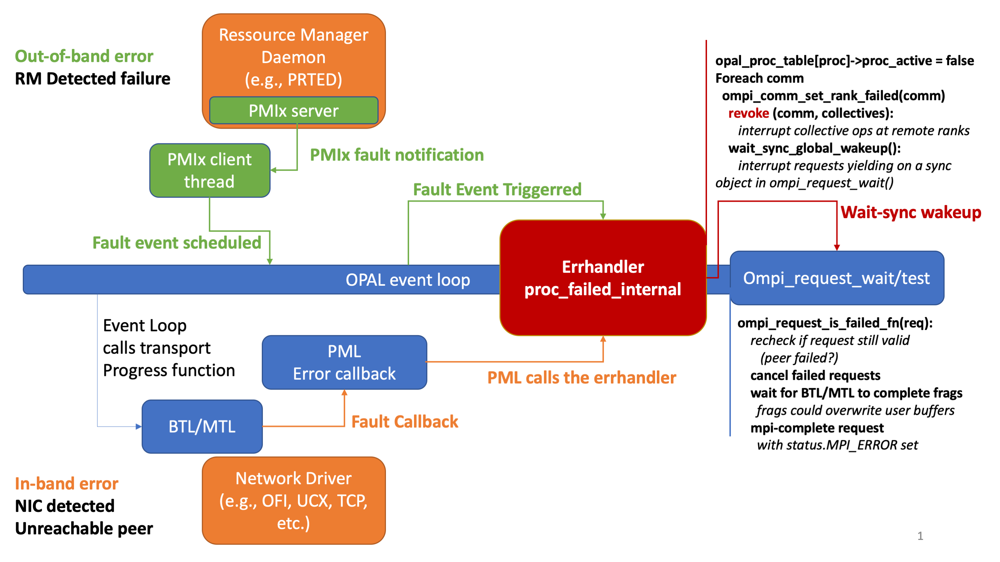

ULFM OPEN MPI COMPONENTS DESIGN AND REQUIREMENTS FOR FAULT TOLERANT OPERATION
=============================================================================

This documents the requirements and best practices for Open MPI
components to support operating accross failures with the
**User Level Failure Mitigation (ULFM)** Open MPI implementation.
___________________________________________________________________________
[TOC]
___________________________________________________________________________

Introduction
============

This document concerns itself with the support of the User Level Failure
Mitigation (ULFM) MPI Standard draft proposal in Open MPI. The ULFM proposal
is developed by the MPI Forum's Fault Tolerance Working Group to support
the continued operation of MPI programs after crash (node failures) have
impacted the execution. The key principle is that no MPI call (point-to-point,
collective, RMA, IO, ...) can block indefinitely after a failure, but must
either succeed or raise an MPI error.

Open MPI contains the general infrastructure to support this mode of operation.
MPI operations may produce three supplementary error codes and the recovery
of the MPI capability for communicating with five supplementary interfaces
(see [http://fault-tolerance.org/wp-content/uploads/2012/10/20170221-ft.png]
(ULFM chapter) standard draft document).

+ `MPIX_ERR_PROC_FAILED` when a process failure prevents the completion of
  an MPI operation.
+ `MPIX_ERR_PROC_FAILED_PENDING` when a potential sender matching a non-blocking
  wildcard source receive has failed.
+ `MPIX_ERR_REVOKED` when one of the ranks in the application has invoked the
  `MPI_Comm_revoke` operation on the communicator.
+ `MPIX_Comm_revoke(MPI_Comm comm)` Interrupts any communication pending on
  the communicator at all ranks.
+ `MPIX_Comm_shrink(MPI_Comm comm, MPI_Comm* newcomm)` creates a new
  communicator where dead processes in comm were removed.
+ `MPIX_Comm_agree(MPI_Comm comm, int *flag)` performs a consensus (i.e. fault
  tolerant allreduce operation) on flag (with the operation bitwise or).
+ `MPIX_Comm_failure_get_acked(MPI_Comm, MPI_Group*)` obtains the group of
  currently acknowledged failed processes.
+ `MPIX_Comm_failure_ack(MPI_Comm)` acknowledges that the application intends
  to ignore the effect of currently known failures on wildcard receive
  completions and agreement return values.

While the general infrastructure for fault tolerance support is available in
Open MPI, communication components (i.e., BTL, PML, MTL components) need to
refrain from aborting the whole application, and return
errors for fault event detected during communication operations to the upper
layers of the Open MPI infrastructure to handle the error condition.
The following sections describe specific requirements for the named area.

Pathways for reporting failures
===============================

Process failures can be detected through two separate mechanisms as illustrated
in the following figure:



1. The network transport is incapable of completing some communication operation
   with the peer (send, recv, atomic operation, etc.). The network transport
   component (BTL, MTL) should report the failure to the PML, so that the PML
   has a chance of reacting, performing necessary cleanup, and initiate recovery
   actions as needed by trigerring the `errhandler_proc_failed_internal` function.

2. The runtime environment (PRTE) has identified a peer failure. A PMIx event
   notification containing the identification of the impacted processes will be
   received from the PMIx thread, and transitionned as an event in the main
   OMPI progress loop. This event will cause the OMPI errhandler function
   `errhandler_proc_failed_internal` to be called.

Error Completion and Requests
-----------------------------

Once a failure has been reported, MPI will have to complete requests that are
representing communication operations with the failed process(es). The operation
may involve the failed process directly (a receive from a failed process), or
indirectly (a collective operation in which a failed process should participate;
an ANY_SOURCE receive).

The `errhandler_proc_failed_internal` function considers all communicators in turn
and if a failed process appears in the group of the communicator, 1) pending
any-source receive on comm return an error; 2) collective operations
on comm will be **revoked**, that is, complete at all ranks (in error at some of the
ranks, but maybe not all); 3) point-to-point communication with a failed peer are
completed in error.

Request fields used for Fault Tolerance
---------------------------------------

In order to track the error status of a request, some fields of a request must always
be initialized and updated correctly.

* `req->req_status.MPI_ERROR`: The error status field of the request needs to be
  initialized to `OMPI_SUCCESS` when the request is allocated. This field will be
  updated by `ompi_request_wait` and similar functions to mark the request as in
  need of attention. Of note: this is the internal status of the request, and
  it can be initialized without undesirable side effect on the `MPI_STATUS` object
  returned from `MPI_WAIT` (and similar).

* `req->req_type`: Fault tolerance operations support the following types of requests:
  `OMPI_REQUEST_PML` (a point-to-point request), `OMPI_REQUEST_COLL` (a non-blocking
  collective communication request), and `OMPI_REQUEST_COMM` (a communicator creation
  request, e.g., `ompi_comm_dup`, `ompi_comm_idup`). Other types of requests are not yet
  supported and if your component requires such support, cases handling new types of
  requests must be added in `ompi/request/req_ft.c::ompi_request_is_failed_fn`.

* `req->req_mpi_object`: This field must contain the `comm` on which the request operates.
  This is true for PML, NBC, as well as COMM types of requests (see above).

* `pml_req->req_peer`: for a PML type request, this field must contain the `peer` that the
  request is trying to communicate with. This field is used to identify requests that
  directly involve failed processes.

* `pml_req->req_tag`: for a PML type request, this field is used to identify requests that
  represent collective operations (refer to `ompi_request_tag_is_collective()` for the
  tag space), or resilient operations, i.e., for implementing internal resilient operations,
  like `MPI_COMM_AGREE`, `MPI_COMM_SHRINK`, etc. (refer to `ompi_request_tag_is_ft()`).

Wait-sync
---------

The **wait_sync** Multithreaded wait-synchronization object is an optimization that reduces
concurrent active polling in `ompi_request_wait` and other similar functions. In order for
requests to be rechecked for fault error condition (and hence completed in error), the
wait_sync must be interrupted. Note that all sync objects will be interrupted upon an
error. Request whose state is not failed will return into a new sync object; request
whose state is failed will complete in error and return control to the user. The
`sync->status` field will contain the reason for interrupting the sync object.

Modifications to the wait-sync logic must pay attention to not damage the error path.
That is, a meaningfull error must be present in `sync->status` when an error condition is
found, and the `wait_sync_global_wakeup()` function does require tracking of all currently
active `sync` objects. In the `pthreads` sync implementation, the management of multiple
threads each using a different `sync` object also uses a list of active `sync`, which is
parsed by the global wakeup function. The only needed adaptation for supported
fault tolerance in the `pthreads sync `is to also populate the `sync` list in the
single-threaded code path (so that it can be found by global wakeup using the same
mechanism as for the multi-threaded case).

BTL components
==============

In order to support fault tolerance, BTL components must provide the following functionality:

Driver error capture
--------------------

Capture and convert driver error codes returned from the NIC driver operations (e.g.,
`fi_write`). Most driver functions provide an error code that indicate error conditions on a
per-operation basis by default. Some network drivers may require setting the endpoint in a
special mode to enable error reporting. For example, the `UCX` driver aborts within the driver
function itself if the endpoint is not created with the `UCT_IFACE_PARAM_FIELD_ERR_HANDLER` mode.

Driver error verbosity
----------------------

The BTL that encounters a process failure or unexpected peer disconnect can output an error
message to the console using the `BTL_PEER_ERROR` macro. Non process fault error should use
the `BTL_ERROR` macro instead. When fault tolerance is inactive (default), both macros are
equally verbose and will inform the end-user of the details of the communication issue.
However, when fault tolerance is active, process failure events are correctible, and
verbose error reporting is generally undesired at the BTL level. Thus, unlike the
`BTL_ERROR` macro, the `BTL_PEER_ERROR` macro is silent when fault tolerance is active.
For debugging purposes, the messages produced by `BTL_PEER_ERROR` can be enabled with
fault tolerance by either setting the `btl_base_verbose` MCA to a value greater than 1,
or by setting the `"btl_base_warn_peer_error"` to `true`.

Do not abort within the component
---------------------------------

Refrain from aborting within the component itself when an error is reported by a driver
function. Driver errors should be converted to an appropriate `OPAL_ERR_XYZ` and transmitted
to the caller component. For example, in the BTL `ofi` component, every error would be
treated as fatal by calling the `MCA_BTL_OFI_ABORT()`. As a replacement, the `ofi` BTL has
been adapted to replace these aborting calls with `BTL_PEER_ERROR`, followed by
`mca_btl_ofi_context_finalize()` to clean the endpoint associated with the error peer,
before returning the error code `OPAL_ERR_UNREACH` to the caller.

The following code sample shows one place where the OFI BTL is adapted to avoid aborting
when a CQ read error occurs, output an error message with the appropriate verbosity,
perform endpoint cleanup, and return an appropriate error code to the upper layer. This
change (and similar changes at other places) are sufficient to enable resumed operation
of OB1 over the OFI BTL, and thus fault recovery.

    diff --git a/opal/mca/btl/ofi/btl_ofi_context.c b/opal/mca/btl/ofi/btl_ofi_context.c
    index bd399c62..ffafb96c 100644
    --- a/opal/mca/btl/ofi/btl_ofi_context.c
    +++ b/opal/mca/btl/ofi/btl_ofi_context.c
    @@ -437,13 +437,14 @@ int mca_btl_ofi_context_progress(mca_btl_ofi_context_t *context) {

         /* cq readerr failed!? */
         if (0 > ret) {
    -            BTL_ERROR(("%s:%d: Error returned from fi_cq_readerr: %s(%d)",
    +            BTL_PEER_ERROR(NULL, ("%s:%d: Error returned from fi_cq_readerr: %s(%d)",
                        __FILE__, __LINE__, fi_strerror(-ret), ret));
             } else {
    -            BTL_ERROR(("fi_cq_readerr: (provider err_code = %d)\n",
    +            BTL_PEER_ERROR(NULL, ("fi_cq_readerr: (provider err_code = %d)\n",
                            cqerr.prov_errno));
             }
    -        MCA_BTL_OFI_ABORT();
    +        mca_btl_ofi_context_finalize(context, context->rx_ctx != context->tx_ctx);
    +        return OPAL_ERR_UNREACH;
         }
     #ifdef FI_EINTR
         /* sometimes, sockets provider complain about interupt. We do nothing. */

Complete affected fragments
---------------------------

Closing the affected endpoint should have the effect of completing the associated
fragments pending on the endpoint. If fragments remain pending in the network interface,
RDMA operations may still be updating the user buffers and prevent the PML level from
releasing the associated MPI requests. Thus, the BTL should complete and cleanup
pending fragments and update the associated requests so that request completion
(potentially in error) can be safely reported by the PML layer to the end-user.

Use the error callback mechanism
--------------------------------

The BTL should invoke the error callback registered by the PML when a process error is
produced within the component. The BTL module contains the API funcion `btl_register_error`.
The PML will attach a callback for managing the error at the PML level. A good example of
using the error callback is found in the TCP BTL. When an error is produced within the
TCP BTL, the endpoint is marked with a special internal flag, and is then closed. Upon
closing an endpoint, the error status is checked, and if an error condition caused the
endpoint closing, the registered error callback is triggered.

MTL Components
==============

In general terms, the same functionalities must be provided by MTL components to support
fault tolerance. The MTL component should not abort internally. The peer failure should be
visible to the `cm` PML through error codes passed in the return values of the MTL module calls.
Most of the actual management of the error is expected to happen at the level of the `cm` PML.

PML Components
==============

Capturing errors with the PML
-----------------------------

The PML should not abort internally, but instead set error codes in the internal status
of requests that have been impacted by a failure. The PML can capture errors from the
BTL components through the registered error callback that can be attached using the
`bml_register` interface. This callback is a prime position in the software stack to
transfer the handling of process failure errors to the cleanup and recovery part of the
MPI library, i.e., to invoke the errhandler `errhandler_proc_failed_internal` function.

This function will then be in charge of updating requests, proc arrays, communicators, etc,
and will also call-back into the PML to trigger the cleanup of PML level structures and
matching queues in a generic and organized way.

Cancellation of failed requests
-------------------------------

When a request is identified as being in error due to a process failure, it needs to be
completed. This is achieved by having MPI completing calls (e.g., MPI_WAIT) to reconsider
the status of the requests. If a request is found to be in an error state, the request is
first cancelled, and then completed in error. The reason for cancelling the request instead
of directly completing it is to leave an opportunity for the BTL to purge pending fragments
and RDMA orders on the buffer associated with the request, hence ensuring that the request
is `pml_complete` before it is marked as `mpi_complete` (to enforce that the user-buffer is not
updated past the completion of the request).

A consequence is that it is expected that the PML supports the cancellation of requests
that communicate with failed processes. The following code-snippet illustrates how the
cancellation of requests in error is managed in the OB1 PML. Note how general support for
cancellation of request to/from non-failed processes is not required.

    if( true != request->req_match_received ) { /* the match has not been already done */
        assert( OMPI_ANY_TAG == ompi_request->req_status.MPI_TAG ); /* not matched isn't it */
        if( request->req_recv.req_base.req_peer == OMPI_ANY_SOURCE ) {
            opal_list_remove_item( &ob1_comm->wild_receives, (opal_list_item_t*)request );
        } else {
            mca_pml_ob1_comm_proc_t* proc = mca_pml_ob1_peer_lookup (comm, request->req_recv.req_base.req_peer);
            opal_list_remove_item(&proc->specific_receives, (opal_list_item_t*)request);
        }
    }
    else { /* it has matched */
        if( ompi_comm_is_proc_active( comm, request->req_recv.req_base.req_peer,
                                              OMPI_COMM_IS_INTER(comm) ) ) {
            opal_output_verbose(10, ompi_ftmpi_output_handle,
                                "Recv_request_cancel: cancel denied for request %p because it has matched peer %d\n",
                                (void*)request, request->req_recv.req_base.req_peer);
            return OMPI_SUCCESS;
        }
        else {
            /* This process is dead, therefore this request is complete */
            opal_output_verbose(10, ompi_ftmpi_output_handle,
                                "Recv_request_cancel: cancel granted for request %p because peer %d is dead\n",
                                (void*)request, request->req_recv.req_base.req_peer);
        }
    }
    /**
     * As now the PML is done with this request we have to force the pml_complete
     * to true. Otherwise, the request will never be freed.
     */

    ompi_request->req_status._cancelled = true;
    recv_request_pml_complete(request);

Supporting the Revoke operation
-------------------------------

The `MPIX_COMM_REVOKE` operation lets the user interrupt all ongoing operation on `comm`.
The principal use case is to stop the ongoing communication pattern when a process
failure error is reported at a given rank. Once a rank has experienced an error,
it is likely that it needs to stop communicating according to the pre-fault
communication pattern, and must instead enter a distinct communication pattern
to recover MPI object or application dataset. However, another process that has
a pending operation that peer with that rank is at risk of deadlocking in that
case: its pending operation does not necessarily peer with a failed process, thus may
not be interrupted with an `MPI_ERR_PROC_FAILED` error. Yet, that operation will not be
matched, hence it may never complete. The solution is for the rank that initially
experienced the process fault error to call the `MPIX_COMM_REVOKE` operation when it
is intent in abandonning an ongoing communication pattern.

The `MPIX_COMM_REVOKE` operation will cause all operations on `comm` (pending or future)
to be interrupted with the specific error class `MPI_ERR_REVOKED`. This in turn will
ensure that no process deadlock on unmatched operations.

It is unlikely that a developper will need to concern himself with the reliable
broadcast algorithm that propagates the revoke order between the processes of
a communicator. On the other hand, when a communicator is revoked, the PML needs to
identify which requests need to be interrupted, and do so in an orderly fashion.

When a communicator is revoked, the new PML module function `pml_revoke_comm()` is
called. This function considers the unexpected fragments and matching queues, and
makes a determination of how to best interrupt the corresponding requests. A
difficult part of this operation is that the communication must be interrupted
in a state that is consistent between the two peers. For example, if a send
request is revoked before completion, it is mandatory that the corresponding
recv request is also revoked (otherwise a deadlock would arise). Multiple
implementation choices are possible, but lets describe how the PML OB1 cleans
ongoing requests. The OB1 implementation makes a determination of when to
cancel an ongoing communication by considering the state of the request at
the receiver. There are 3 cases:

1. Send requests are never directly revoked. The decision to revoke a particular
   communication is taken at the receiver end, and the communication protocol
   will inform the sender of what actions to take if the receiver decided to revoke
   the communication.
2. The receive request is not present in the matching queue anymore (it has matched,
   and the communication protocol has advanced to the next stage (possibly RDMA
   operations at the NIC level). Cancelling this case can be very difficult and is not
   always supported by all network types. For this reason, in this case, the operation
   is allowed to proceed to completion. Since the request has already matched, as long
   as the sender does not fail, this request will complete.
3. If the receive request is still present in the matching queue (that is, the
   request has not matched yet), or is just posted. In this case, the request is marked
   with the appropriate error code, and is removed from the matching queue. The communicator
   is marked as revoked already.
4. A new fragment is received, or a fragment is available in one of the unexpected
   queues. In this case, the fragment has not yet matched a receive request. The
   receiver decides that the communication is now revoked. Instead of sending the
   normal control message that initiates the next stage of the communication protocol
   (e.g., rendez-vous, rdma pipeline, etc.), the receiver answers to the frag
   with a NACK control message that indicates to the sender that
   the communication is now completed in error and no further steps should
   be taken at the sender to continue that send-request.

Again, different PML/MTL may have different implementation for stopping ongoing
communication when a revoke occurs. The described implementation has the major
advantage that it does not require the BTL/network driver to be able to
cancel or interrupt ongoing RDMA operations. Another implementation may be able
to close an endpoint, thus causing all ongoing operations to implicitely terminate.

Note that legacy components may use static initializers to fill-in the component
module structure. This practice should be avoided in general, because it will
cause silently compiling incorrect code when the module function ordering changes.
The addition of `pml_revoke_comm` is one such change. It is recommended
that all `pml` components move to named fields static initializers to ensure the
appropriate functions are set to the appropriate module fields regardless of
field ordering.

Collective operations
=====================

The agree operations
--------------------

The `coll` framework module now includes two new operations `coll_agree` and `coll_iagree`.
It is expected that, at least at an initial stage, most `coll` framework will not
provide their own implementation of the agreement operations. When fault tolerance
is runtime disabled, a base implementation of these operations is provided
(`coll_base_agree_noft`) by the `coll_basic` module and will be installed as the
default implementation. That is, a collective module does not need to implement
an agreement.

The `coll_ftagree` component provides an optimized fault tolerant
implementation of these operations, and is loaded when fault tolerance is
enabled at runtime. If a collective component wants to substitute its own
implementation of the agreement, the normal priority rules for component selection
apply (i.e., users and develloppers can tweak the values of MCA parameters
`coll_ftagree_priority` and `coll_xyz_priority` to prefer one over the other.

Note that legacy components may use static initializers to fill-in the component
module structure. This practice should be avoided in general, because it will
cause silently compiling incorrect code when the module function ordering changes.
The addition of `coll_agree` and `coll_iagree` is one such change. It is recommended
that all `coll` components move to named fields static initializers to ensure the
appropriate functions are set to the appropriate module fields regardless of
field ordering.

Interrupting collectives in error
---------------------------------

The same issue that commands the availability of the `MPIX_COMM_REVOKE` can also
happen within the implementation of the collective operation itself. Many `coll`
components use a set of point-to-point operations internally, and when a failure
is reported at a given step in the collective operation at a particular rank, it
does not entail that other ranks have also observed that same failure. Thus, if
the rank that has experienced a point-to-point error jumps out of the collective
operation without completing the full communication schedule for the collective
communication, it may leave other rank pending on unmatched collective internal
point-to-point communication operation. In that case, the collective operation
would deadlock at the ranks that have not observed the failure through
point-to-point operations with the failed process.

Two approaches are possible to eliminate this issue.

1. The first approach requires heavy modification of the `coll` component to support
fault tolerance operation. It is based on unconditionally completing the communication
schedule of the collective operation, but substituting the actual content of
post-error messages with special values indicating that the collective operation
should cause an MPI error at the peer rank. This in essence requires the implementation
of the collective operations to itself become fault-aware and, to some extent resilient.
As a consequence, this approach is expected to be used only in special cases (e.g., it
is currently used in the implementation of MPI_COMM_SPAWN), but in the general case,
collective frameworks require less intrusive modifications when using the second mechanism.
When a collective operation wants to use this methodology, it needs to add its collective
tags to the range of reserved collective tags that are non-interruptible (see the
function `ompi_request_tag_is_ft()` for details).

2. The second approach, which is provided by the shared Open MPI infrastructure,
is for the occurence of a fault at any rank to cause the interruption of all
collective operations at all ranks on the communicator. This feature is
implemented by the `errhandler_proc_failed_internal()` calling the `ompi_comm_revoke()`
operation internally, with the special mode `coll_only`. This call will cause the
interruption of all requests on `comm` with a collective tag (i.e., one of the tags
in the range defined by function `ompi_request_tag_is_collective()`) with the error
`MPI_ERR_PROC_FAILED`. Thanks to this mechanism, the collective implementation
can do per-request error handling, and bail-out from the collective communication
pattern as soon as one error is reported. The implicit revoke of collective
operations will ensure that other ranks will either complete the collective
successfully (if all contributions to their output buffers were available
despite the failure), or be appropriately interrupted during one of the
internal communication operations, even when it does not directly peers with
a failed process.

Internal request cleanup
------------------------

Collective operations often require the use of internal requests to follow
the advancement of internal point-to-point operation comprising the
communication pattern. Care must be taken to not simply `ompi_request_free`
these requests in the error case, as doing so does not enforce completion.
That is, the buffer associated with such a request may still be receiving
updates from the network receiving message fragments, or RDMA updates.

Instead, the cleanup of such requests must wait that they complete in error
(as they will, due to the mechanism discussed in the above paragrah). Note
that only process failure errors are garanteed to complete in error. Other
types of errors may deadlock if the request is waited. An example of the
appropriate cleanup of fault-interrupted requests is found in `coll_base_util.c`

    @@ -76,6 +76,26 @@ int ompi_coll_base_sendrecv_actual( const void* sendbuf, size_t scount,
         if (MPI_STATUS_IGNORE != status) {
             status->MPI_ERROR = err;
         }
    +    if( MPI_REQUEST_NULL != req ) {
    +#if OPAL_ENABLE_FT_MPI
    +        if( MPI_ERR_PROC_FAILED == req->req_status.MPI_ERROR
    +         || MPI_ERR_PROC_FAILED_PENDING == req->req_status.MPI_ERROR
    +         || MPI_ERR_REVOKED == req->req_status.MPI_ERROR ) {
    +            /* We cannot just 'free' and forget, as the PML/BTLS would still
    +             * be updating the request buffer after we return from the MPI
    +             * call!
    +             * For other errors that do not have a well defined post-error
    +             * behavior, calling the cancel/wait could deadlock, so we just
    +             * free, as this is the best that can be done in this case. */
    +            ompi_request_cancel(req);
    +            ompi_request_wait(&req, MPI_STATUS_IGNORE);
    +            if( MPI_ERR_PROC_FAILED_PENDING == err ) {
    +                err = MPI_ERR_PROC_FAILED;
    +            }
    +        } else /* this 'else' intentionaly spills outside the ifdef */
    +#endif /* OPAL_ENABLE_FT_MPI */
    +        ompi_request_free(&req);
    +    }
         return (err);

Non-blocking collectives and Generalized requests
-------------------------------------------------

Non-blocking collective and generalized requests operations can be comprised of
sub-requests. The final error that is presented to the end-user is presented
in the completion status of the top-level request. It is however common for the
top-level request to simply orchestrate the submission and completion of
a number of sub-requests, rather than engaging directly in communication
operations. The general design for fault tolerance in this case is that the
lowest level of requests (that is, request that represent actual communication
that go down to the BTL/MTL layers) produce errors. These errors are then captured
during the execution of the sub-request schedule. If a sub-request is found in error,
the schedule is interrupted, the higher level request is also marked in error, and
control is returned to the upper level of the schedule, up until the top-level request
is also marked in error. Note that like normal collective operations, the implicit
revocation of collective operations on the communicator impacted by a failure
ensures that it is safe to bail-out from the schedule in a localized manner.
Other ranks will also experience an error in operations that are blocking thus
ensuring that no deadlock arises.

A good example of that mode of operation can be found in the
`libnbc` collective communication component progres in `mca/coll/libnb/nbc.c`:

    @@ -334,8 +336,20 @@ int NBC_Progress(NBC_Handle *handle) {
         /* don't call ompi_request_test_all as it causes a recursive call into opal_progress */
         while (handle->req_count) {
            ompi_request_t *subreq = handle->req_array[handle->req_count - 1];
    +#if OPAL_ENABLE_FT_MPI
    +        if (REQUEST_COMPLETE(subreq)
    +         || OPAL_UNLIKELY( ompi_request_is_failed(subreq) )) {
    +#else
             if (REQUEST_COMPLETE(subreq)) {
    +#endif /* OPAL_ENABLE_FT_MPI */
                 if(OPAL_UNLIKELY( OMPI_SUCCESS != subreq->req_status.MPI_ERROR )) {
    +#if OPAL_ENABLE_FT_MPI
    +                if( MPI_ERR_PROC_FAILED == subreq->req_status.MPI_ERROR ||
    +                    MPI_ERR_PROC_FAILED_PENDING == subreq->req_status.MPI_ERROR ||
    +                    MPI_ER_REVOKED == subreq->req_status.MPI_ERROR ) {
    +                    NBC_DEBUG (1, "MPI Error in NBC subrequest %p : %d)", subreq, subreq->req_status.MPI_ERROR);
    +                } else // this 'else' intentionally spills outside the ifdef
    +#endif /* OPAL_ENABLE_FT_MPI */
                     NBC_Error ("MPI Error in NBC subrequest %p : %d", subreq, subreq->req_status.MPI_ERROR);
                     /* copy the error code from the underlying request and let the
                      * round finish */

Changing CID algorithms
-----------------------

This section describes some specificities of the allocation of CID under fault
tolerant operations, and is addressed to developpers intending to modify the CID
algorithm.

The `MPI_COMM_REVOKE` operation interrupts all calls on the communicator. Because it is
a resilient operation, the revoke notification is sent using a reliable broadcast.
Unlike a normal broadcast, a given process will receive multiple reliable broadcast
messages for each revoke operation. As is the nature of asynchronous systems, timing
of reception may cause a revoke notification to reach a particular process much later
than anticipated. In that case, the process may have already produced the
`MPI_ERR_REVOKED` to the end-user, and the impacted communicator may have then been
freed using `MPI_COMM_FREE`. In this case, a new communicator may have re-used the
context identifier (CID), since it is now free from reuse. Thus, late reliable
broadcast that pertain to a prior communicator using that CID could erroneously
revoke that new communicator, and must be ignored.

In order to perform that discrimination between communicators using the same CID at
different time periods, revoke notice messages themselves are decorated with the CID
of the communicator to revoke, as well as the epoch at which they have been produced.
This epoch number is also attached to every communicator when it is created.
This uniquely identify the communicator that must be revoked independently of the time
period at which the revoke notification is received.

In order to associate an unique couple (CID,epoch) to communicators, the CID allocation
algorithm has been expanded to integrate the computation of the epoch as a byproduct
of the normal operation of hte CID algorithm. The way the normal CID algorihm operates
is based on a multi-step non-blocking allreduce operation to select the best global
CID. At each round, every rank proposes one (or many) CID that are locally available.
A non-blocking allreduce then identifies the best among all propositions (if any). If
a good CID is found, a second allreduce confirms the choice. If no good CID is found,
that second allreduce will trigger another round of propositions and the algorithm
repeats. In order to not increase the complexity of that algorithm, the selection of the
epoch is integrated into the second allreduce that flags the successful selection of a
proposed CID. A developper that wants to modify the CID algorithm must pay attention to
the  computation of teh epoch.  Ideally the two numbers can be computed in a combined fashion.

Testing Fault Tolerant Operation
================================

Testing fault-tolerant operation extensively can be hard. Unlike normal communication for
which the matching and ordering semantic simplify the space of possible ordering of
messages, faults may interrupt communication at any time, including in the middle
of a transfer, during RDMA updates, etc. Over the years we have come up with a number of
tests that stress particular aspects of the communication infrastructure, or represent
common resilience patterns that users are likely to exercise.

The following repository contains a set of tests that can be used to exercise fault
tolerance in MPI: [https://github.com/ICLDisco/ulfm-testing]

Testing general error handling
------------------------------

Test `api/err_handler.c` gives an estimate of the time it takes to report an error during
an `MPI_BARRIER`. The test times a barrier without fault, injects a process failure,
times the barrier again (time for new fault to be reported), and then times a barrier again
(time for an old fault to be reported). The test also verifies that communication between
non-faulty processes remain possible.

Test `api/err_any.c` verifies that ANY_SOURCE receptions are correctly interrupted when a
potential sender fails. The test also verifies that ANY_SOURCE operations are again
operational after the use of `MPIX_Comm_failure_ack()` and counts that the correct number
of errors gets reported to the application level.

Test `api/getack.c` verifies that errors that have been reported through `MPIX_Comm_get_failed()`
are indeed resulting in communication with the reported process returning an error of class
`MPIX_ERR_PROC_FAILED` as mandated.

Stress test for the Revoke operation
------------------------------------

Test `api/revoke.c` verifies that non-matched pending operations get correctly interrupted by
the use of API call` MPIX_Comm_revoke()`. ISend and IRecv operations are posted before a
barrier ensures that the corresponding completion cannot happen before the operation
gets revoked. This is a good stress test when debugging the cleanup of revoked
operations from the PML matching queues.

Stress test for BTL timeout
---------------------------

Test `stress/pingpairs.c` is designed to exercise the case of in-band detection of failure,
and thus the cleanup code for fragments of requests whose peer with a failed process.
This test executes a ring-like neighbor pattern that is repeated for a long-enough
period of time that the network driver will reach the maximum retry-count timeout.
This will verify that errors are reported quickly from the failure detector, and that
the occurence of retry timeout at the BTL level do not cause issues (like unexpected
aborts in the BTL, or crash due to orphaned fragments cleanup).

Stress test for MPI_COMM_SPAWN
------------------------------

`MPI_COMM_SPAWN` is often employed to replace failed processes in application usage patterns.
The test `stress/spawn.c` is designed to force the detection of a process failure to happen
during the `MPI_COMM_SPAWN` operation itself, thus exercising the error reporting in that case.

Application patterns
--------------------

The `tutorial/sc19` directory contains a set of application patterns that are demonstrated for
instruction purposes. These application pattern also represent common use-cases that are to
be found in the wild, and are good representative of what capabilities will get exercised
in production.

Test `03.undisturbed.c` verifies that communication in communicators that do not have failed
processes can continue, meanwhile communication with a failed process report an error. It
also exercise `MPI_Sendrecv`.

Test `05.err_coll.c` verifies that a blocking collective communication completes (possibly in
error) at all ranks. This test is designed for a process failure to be detected during the
collective operation, and can be used as a skeletton to track issues with a particular
collective operation by just substituting the collective call of interest.

Test `07.err_comm_grid2d.c` is designed for a process failure to be detected during a communicator
creation function. The test issues two `MPI_COMM_SPLIT`, and then proceed to agree if all
ranks have succeeded the operation. This is a good test to track issues with the CID
algorithm. This test will also exercise the non-blocking allreduce, as this operation
is employed in the CID algorithm.

Test `09.insulation` verifies that errors are reported in collective operations only if the
underlying communicator contains a failed process. The world is divided in two halves,
only one of which suffers a failure.

Test `12.buddycr` is representative of the very common usage pattern where replacement processes
are spawned to take the place of failed processes. The test will perform some mockup computation
with an iterative-like compute loop with collective communication in the loop. Periodically, the
dataset is checkpointed on a *buddy* rank. When a fault is injected, it is likely detected during
the checkpoint operation, thus stress testing `MPIX_COMM_AGREE`, `MPIX_COMM_SHRINK` and `MPI_COMM_SPAWN`.


Examples of issues in components that are not yet fault tolerant
================================================================

In this section, we discuss the features that were missing in some of the major Open MPI components.
The goal of this section is to present an example of the process and methodology used to add
fault tolerance to not yet enabled components.

OFI fault tolerance with the OFI MTL
------------------------------------

While OFI fault tolerance is supported using the OB1 PML, with the OFI BTL, this is a workaround
for the fact that the OFI MTL does not currently support fault tolerance. Here is a list of
issues that have been identified to prevent fault-tolerant operations with this component.


1. The PML CM does not have a `pml_revoke_comm` function
2. The PML CM uses requests of type `OMPI_REQUEST_PML` that are not compatible with a `
   ompi_pml_base_request_t`. This prevents checking the important flags that should be
   present in such a request type, notably as used in `ompi_request_is_ft()`, `
   ompi_request_is_collective()`, and `ompi_request_is_failed_fn()`.
3. The PML CM does not support cancelling requests with a failed peer.
4. The MTL OFI has instances of calling `abort()/exit()` when communication errors are
   reported. In `ompi_mtl_ofi_context_progress()`, an error may be returned from
   `fi_cq_read()` as a consequence of a process failure; this will abort the process
   instead of returning the error.


The UCX PML
-----------

Similarly to OFI, UCX fault tolerance is supported using the OB1 PML, with the UCT BTL. Again, this
is a workaround for the fact that the UCX PML does not currently support fault tolerance.

1. The UCX PML does not pass flags to set UCP endpoints in fault-tolerant mode
2. The UCX PML uses requests of type `OMPI_REQUEST_PML` that are not compatible with
   a `ompi_pml_base_request_t`. Fields needed by `ompi_request_is_failed_fn()` are missing
3. The UCX PML does not have a `pml_revoke_comm` function. The unexpected queues, and
   matching logic is within the UCP component of UCX.
4. When using the UCX PML, no BTL is initialized and the `ftagree` component and the `ompi_comm_revoke()`
   function do direct calls to the BTL to send control messages.

RMA Components
==============

The **OSC** framework is in charge of managing RMA communication.
At the moment, fault tolerance with RMA communication is not supported.
However, the ULFM standard draft document ***does*** define semantics for
RMA fault tolerance, and contributions to enable this feature in Open MPI
are welcome.

I/O Components
==============

The following components manage MPI I/O in Open MPI

- _fs_ File system functions for MPI I/O
- _fbtl_ File byte transfer layer: abstraction for individual read/write
  operations for OMPIO
- _fcoll_ Collective read and write operations for MPI I/O
- _sharedfp_ Shared file pointer operations for MPI I/O

All components in these frameworks are unmodified, **untested** (expect clean
post-failure abort). Again, the ULFM standard draft document **does** define
semantics for File operation fault tolerance, and contributions to enable
this feature in Open MPI are welcome.

___________________________________________________________________________

More Information
================

Author: Aurelien Bouteiller

The [README.FT.ULFM.md] gives a more complete description of current
component support in Open MPI ULFM.

More information (tutorials, examples, build instructions for leading
top500 systems) is also available in the Fault Tolerance Research
Hub website:
  <https://fault-tolerance.org>

## Bibliographic References
If you are looking for, or want to cite a general reference for ULFM,
please use

_Wesley Bland, Aurelien Bouteiller, Thomas Herault, George Bosilca, Jack
J. Dongarra: Post-failure recovery of MPI communication capability: Design
and rationale. IJHPCA 27(3): 244-254 (2013)._

Available from: http://journals.sagepub.com/doi/10.1177/1094342013488238.
___________________________________________________________________________

Copyright
=========

```
Copyright (c) 2019-2020 The University of Tennessee and The University
                        of Tennessee Research Foundation.  All rights
                        reserved.

$COPYRIGHT$

Additional copyrights may follow

$HEADER$
```
