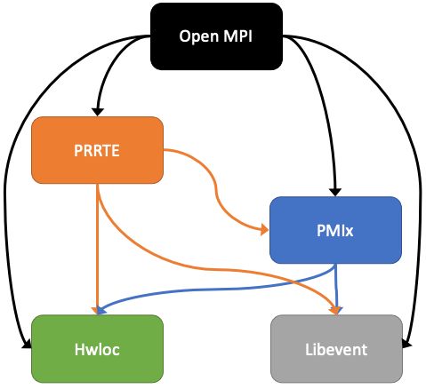

.. _label-install-required-support-libraries:

Required support libraries
==========================

While Open MPI can be built with support for a wide variety of
systems, a small set of support libraries are *required* in order to
build Open MPI in *any* environment.  Several of these packages are
both fundamental to Open MPI's operation and not universally available
in all environments.  As such, these "fundamental" packages are both
embedded in Open MPI's distribution tarballs and also directly
incorporated into Open MPI's configure, build, and installation
process.

:ref:`See below
<required-support-libraries-configure-discovery-label>` for a
description of how Open MPI chooses whether to use the embedded
versions of these packages or versions already installed on your
system.

* `Hardware Locality <https://www.open-mpi.org/projects/hwloc/>`_

  * This library is required; Open MPI will not build without it.
  * **Minimum version required:** |hwloc_min_version|

    .. note:: While the minimum version of Hwloc will *work*, it may
              still have bugs and/or have less functionality as
              compared to later versions.

              Other than the Hwloc restriction about v3.0.0 and beyond
              (see below), the Open MPI community generally recomends
              using the latest available version of Hwloc unless there
              is a specific reason not to.

  * **Version embedded in Open MPI distribution:**
    |hwloc_embedded_version|

  .. danger:: As of |ompi_ver|, Open MPI does not yet support the
              Hwloc v3.x series (which may not even be available at
              the time of Open MPI |ompi_ver|'s release).  Hwloc v3.x
              is anticipated to break API and/or ABI compared to the
              Hwloc v2.x series.

              Open MPI will refuse to build if it finds an external
              Hwloc installation that is >= v3.0.0 on the assumption
              that other HPC applications and/or libraries may be
              using it.  Such a configuration could lead to obscure
              and potentially confusing run-time failures of Open MPI
              applications.

              If Open MPI's ``configure`` script aborts because it
              finds an Hwloc installation that is >= v3.0.0, you can
              either ensure that Open MPI finds a < v3.0.0 Hwloc
              installation (e.g., by changing the order of paths in
              ``LD_LIBRARY_PATH``), or force the use of Open MPI's
              bundled Hwloc via:

              .. code::

                 shell$ ./configure --with-hwloc=internal ...

              Regardless, *it is critically important* that if an MPI
              application |mdash| or any of its dependencies |mdash|
              uses Hwloc, it uses the *same* Hwloc with which Open MPI
              was compiled.

* `Libevent <https://libevent.org/>`_

  * This library is required; Open MPI will not build without it.
  * **Minimum version required:** |event_min_version|
  * **Version embedded in Open MPI distribution:**
    |event_embedded_version|

    .. note:: The Open MPI community has heavily tested Libevent
              |event_embedded_version|.  Other versions should *work*,
              but |mdash| unlike Hwloc, OpenPMIx, and PRRTE |mdash|
              there is not much reason to upgrade to use a later
              version of Libevent.

* `OpenPMIx <https://docs.openpmix.org/>`_

  * This library is required; Open MPI will not build without it.
  * **Minimum version required when building without PRRTE:**
    |pmix_min_version|

    .. note:: While the minimum version of OpenPMIx will *work*, it
              may still have bugs and/or have less functionality as
              compared to later versions.

              The Open MPI community generally recomends using the
              latest available version of OpenPMIx unless there is a
              specific reason not to.

    .. note:: While `OpenPMIx <https://docs.openpmix.org/>`_ is the
              formal name of the software that implements the `PMIx
              <https://pmix.org/>`_ standard, the term "PMIx" is used
              extensively throughout this documentation to refer to
              the OpenPMIx software package.

  * **Minimum version required when building with PRRTE:** `See the
    PRRTE project documentation <https://docs.prrte.org/>`_.
  * **Version embedded in Open MPI distribution:**
    |pmix_embedded_version|

* `PRRTE <https://github.com/openpmix/prrte>`_

  * This library is optional in some environments. See below.
  * **Minimum version required:** |prte_min_version|

    .. note:: While the minimum version of PRRTE will *work*, it may
              still have bugs and/or have less functionality as
              compared to later versions.  For example, if you build
              and run with |prte_min_version|, you will not get a
              fully-populated ``mpirun(1)`` man page.

              The Open MPI community generally recomends using the
              latest available version of PRRTE unless there is a
              specific reason not to.

  * **Version embedded in Open MPI distribution:**
    |prte_embedded_version|

  PRRTE provides Open MPI's full-featured ``mpirun`` / ``mpiexec`` MPI
  application launchers (the two commands are identical; they are
  symbolic links to the same executable).

  .. warning:: If you are building the PRRTE that is embedded in the
               Open MPI |ompi_ver| distribution:

               * If you are also building the PMIx that is embedded in
                 the Open MPI |ompi_ver| distribution, that
                 combination of packages is supported.

               * If you are building against an external PMIx
                 installation (i.e., a version of PMIx that is not
                 embedded in the Open MPI |ompi_ver| distribution),
                 you should check `the PRRTE project documentation
                 <https://docs.prrte.org/>`_ to see what minimum
                 version of PMIx is required.

  * If your environment uses another MPI application launcher (e.g.,
    Slurm users can use the ``srun`` launcher to "direct launch" Open
    MPI applications), then the use of PRRTE is optional.
  * If your environment has no other MPI application launcher, then
    you need to install PRRTE and build Open MPI with PRRTE support.
  * Open MPI can use the copy of PRRTE embedded in its source code
    tree, or compile/link against an external PRRTE installation.
    :ref:`See this section for details about how to specify each
    method
    <label-building-ompi-cli-options-required-support-libraries>`.

.. note:: In general, the Open MPI community recommends using the most
          recent versions of both the :ref:`required support libraries
          <label-install-required-support-libraries>` and any other
          optional support libraries.  This is because more recent
          versions typically tend to include bug fixes, sometimes
          affecting Open MPI functionality.  As a specific example,
          there is a known issue with `Hardware Locality
          <https://www.open-mpi.org/projects/hwloc/>`_ releases older
          than v2.8.0 on systems with Intel Ponte Vecchio
          accelerators.  If you run Open MPI on such systems, you need
          to use Hwloc v2.8.0 or newer, or you will experience
          undefined behavior.  This effect is not unique to the
          Hardware Locality library; this is why the Open MPI
          community recommends using as recent as possible versions of
          *all* support libraries.

Library dependencies
--------------------

These support libraries have dependencies upon each other:

.. The "source code" for this figure is simple a PPTX file by the same
   name in this same directory.  If you ever need to edit this image,
   edit the PPTX, export it to PNG, and then trim the whitespace from
   the sides of the image.

   Open MPI required support library dependency graph.

The higher-level boxes depend on the lower-level boxes.  Specifically:

* Open MPI depends on PRRTE, PMIx, Hwloc, and Libevent (i.e.,
  everything).
* PRRTE depends on PMIx, Hwloc, and Libevent (i.e., everything except
  Open MPI).
* PMIx depends on Hwloc and Libevent.
* Hwloc does not depend on anything.
* Libevent does not depend on anything.

At run time, it is critical that the run-time linker loads *exactly
one copy* of each of these libraries.

.. note:: The required support libraries can have other dependencies,
          but for simplicity and relevance to building Open MPI,
          those other dependencies are not discussed here.

Potential problems
------------------

Problems can (will) arise if multiple different copies of the above
shared libraries are loaded into a single process.  For example,
consider if:

* Loading the Open MPI shared library causes the loading of Libevent
  shared library vA.B.C.
* But then the subsequent loading of the PMIx shared library causes
  the loading of Libevent shared library vX.Y.Z.

Since there are now two different versions of the Libevent shared
library loaded into the same process (yes, this can happen!),
unpredictable behavior can (will) occur.

Many variations on this same basic erroneous scenario are possible.
All of them are bad, and can be extremely difficult to diagnose.

Avoiding the problems
---------------------

A simple way to avoid these problems is to configure your system such
that it has exactly one copy of each of the required support libraries.

.. important:: If possible, use your OS / environment's package
   manager to install as many of these support libraries |mdash|
   including their development headers |mdash| as possible before
   invoking Open MPI's ``configure`` script.

Not all package managers provide all of the required support
libraries. But even if your package manager installs |mdash| for
example |mdash| only Libevent and Hwloc, that somewhat simplifies the
final Open MPI configuration, and therefore avoids some potentially
erroneous configurations.

.. _required-support-libraries-configure-discovery-label:

How ``configure`` finds the required libraries
----------------------------------------------

In an attempt to strike a balance between end-user convenience and
flexibility, Open MPI bundles these four required support libraries in
its official distribution tarball.

Generally, if Open MPI cannot find a required support library, it will
automatically configure, build, install, and use its bundled version
as part of the main Open MPI configure, build, and installation
process.

Put differently: Open MPI's ``configure`` script will examine the
build machine and see if it can find each of the required support
header files and libraries.  If it cannot find them, it will attempt
to fall back and use the corresponding bundled support library
instead.

.. important:: Note, however, that ``configure`` is smart enough to
   understand the dependencies between the required support libraries.

   Specifically: If ``configure`` finds the development headers and
   libraries for a given support library already installed on the
   system, then it will ignore both the corresponding bundled support
   library, *and it will also ignore all bundled support libraries
   that are below it in the dependency graph shown above.*

Build example 1
^^^^^^^^^^^^^^^

``configure`` finds the PRRTE development headers and libraries in
``/usr/local``.  This will cause the following to occur:

#. ``configure`` will ignore the PRRTE library that is bundled in the
   Open MPI source tree and will use the PRRTE that is already
   installed in ``/usr/local``.
#. ``configure`` will also ignore the bundled PMIx, Hwloc, and
   Libevent libraries in the Open MPI source tree.

   * If ``configure`` is unable to find header files and libraries for
     PMIx, Hwloc, and Libevent elsewhere on the build machine (i.e.,
     assumedly the same PMIx, Hwloc, and Libevent than the PRRTE in
     ``/usr/local`` is using), this is an error: ``configure`` will
     abort, and therefore refuse to build Open MPI.

Build example 2
^^^^^^^^^^^^^^^

``configure`` does *not* find PRRTE on the build machine, but *does*
find PMIx development headers and libraries in ``/opt/local``.  This
will cause the following to occur:

#. ``configure`` will set up to build the PRRTE library that is
   bundled in the Open MPI source tree.
#. ``configure`` will ignore the PMIx library that is bundled in the
   Open MPI source tree and will use the PMIx that is already
   installed in ``/opt/local``.
#. ``configure`` will also ignore the bundled Hwloc and Libevent
   libraries in the Open MPI source tree.

   * If ``configure`` is unable to find header files and libraries for
     Hwloc and Libevent elsewhere on the build machine (i.e.,
     assumedly the same Hwloc and Libevent than the PMIx in
     ``/opt/local`` is using), this is an error: ``configure`` will
     abort, and therefore refuse to build Open MPI.

Build example 3
^^^^^^^^^^^^^^^

``configure`` only finds the development headers and libraries for
Libevent on the build machine.  This will cause the following to
occur:

#. ``configure`` will set up to build the PRRTE, PMIx, and Hwloc
   libraries that are bundled in the Open MPI source tree.
#. ``configure`` will ignore the Libevent library that is bundled in
   the Open MPI source tree and will use the Libevent that is already
   installed.

Difficulties with C and Fortran
-------------------------------

Sometimes you may see errors similar to the following when attempting
to build Open MPI:

.. code-block::

   ...
   PPFC     profile/pwin_unlock_f08.lo
   PPFC     profile/pwin_unlock_all_f08.lo
   PPFC     profile/pwin_wait_f08.lo
   FCLD     libmpi_usempif08.la
   ld: library not found for -lhwloc
   collect2: error: ld returned 1 exit status
   make``2``: *** ``libmpi_usempif08.la`` Error 1

This error can happen when a number of factors occur together:

#. If Open MPI's ``configure`` script chooses to use an "external"
   installation of `hwloc <https://www.open-mpi.org/projects/hwloc/>`_
   and/or `Libevent <https://libevent.org/>`_ (i.e., outside of Open
   MPI's source tree).
#. If Open MPI's ``configure`` script chooses C and Fortran compilers
   from different suites/installations.

Put simply: if the default search library search paths differ between
the C and Fortran compiler suites, the C linker may find a
system-installed ``libhwloc`` and/or ``libevent``, but the Fortran linker
may not.

This may tend to happen more frequently starting with Open MPI v4.0.0
on Mac OS because:

#. In v4.0.0, Open MPI's ``configure`` script was changed to "prefer"
   system-installed versions of hwloc and Libevent (vs. preferring the
   hwloc and Libevent that are bundled in the Open MPI distribution
   tarballs).
#. In MacOS, it is common for `Homebrew <https://brew.sh/>`_ or
   `MacPorts <https://www.macports.org/>`_ to install:

   * `Hardware Locality <https://www.open-mpi.org/projects/hwloc/>`_
   * `Libevent <https://libevent.org/>`_

For example, as of July 2019, Homebrew:

* Installs hwloc v2.0.4 under ``/usr/local``
* Installs the Gnu C and Fortran compiler suites v9.1.0 under
  ``/usr/local``.  *However*, the C compiler executable is named ``gcc-9``
  (not ``gcc``!), whereas the Fortran compiler executable is
  named ``gfortran``.

These factors, taken together, result in Open MPI's ``configure``
script deciding the following:

* The C compiler is ``gcc`` (which is the MacOS-installed C
  compiler).
* The Fortran compiler is ``gfortran`` (which is the
  Homebrew-installed Fortran compiler).
* There is a suitable system-installed hwloc in ``/usr/local``, which
  can be found |mdash| by the C compiler/linker |mdash| without specifying any
  additional linker search paths.

The careful reader will realize that the C and Fortran compilers are
from two entirely different installations.  Indeed, their default
library search paths are different:

* The MacOS-installed ``gcc`` will search ``/usr/local/lib`` by
  default.
* The Homebrew-installed ``gfortran`` will *not* search
  ``/usr/local/lib`` by default.

Hence, since the majority of Open MPI's source code base is in C, it
compiles/links against hwloc successfully.  But when Open MPI's
Fortran code for the ``mpi_f08`` module is compiled and linked, the
Homebrew-installed ``gfortran`` |mdash| which does not search
``/usr/local/lib`` by default |mdash| cannot find ``libhwloc``, and the link
fails.

There are a few different possible solutions to this issue:

#. The best solution is to always ensure that Open MPI uses a C and
   Fortran compiler from the same suite/installation.  This will
   ensure that both compilers/linkers will use the same default
   library search paths, and all behavior should be consistent.  For
   example, the following instructs Open MPI's ``configure`` script to
   use ``gcc-9`` for the C compiler, which (as of July 2019) is the
   Homebrew executable name for its installed C compiler:

   .. code-block:: sh

      shell$ ./configure CC=gcc-9 ...

      # You can be precise and specify an absolute path for the C
      # compiler, and/or also specify the Fortran compiler:
      shell$ ./configure CC=/usr/local/bin/gcc-9 FC=/usr/local/bin/gfortran ...

   Note that this will likely cause ``configure`` to *not* find the
   Homebrew-installed hwloc, and instead fall back to using the
   bundled hwloc in the Open MPI source tree.

#. Alternatively, you can simply force ``configure`` to select the
   bundled versions of hwloc and libevent, which avoids the issue
   altogether:

   .. code-block:: sh

      shell$ ./configure --with-hwloc=internal --with-libevent=internal ...

#. Finally, you can tell ``configure`` exactly where to find the
   external hwloc library.  This can have some unintended
   consequences, however, because it will prefix both the C and
   Fortran linker's default search paths with ``/usr/local/lib``:

   .. code-block:: sh

      shell$ ./configure --with-hwloc-libdir=/usr/local/lib ...

Overriding ``configure`` behavior
---------------------------------

If ``configure``'s default searching behavior is not sufficient for
your environment, you can use :ref:`command line options to override
its default behavior
<label-building-ompi-cli-options-required-support-libraries>`.

For example, if PMIx and/or PRRTE are installed such that the default
header file and linker search paths will not find them, you can
provide command line options telling Open MPI's ``configure`` where to
search.  Here's an example ``configure`` invocation where PMIx and
PRRTE have both been installed to ``/opt/open-mpi-stuff``:

.. code-block:: sh

   ./configure --prefix=$HOME/openmpi-install \
       --with-pmix=/opt/open-mpi-stuff \
       --with-prrte=/opt/open-mpi-stuff ...

As another example, if you do not have root-level privileges to use
the OS / environment package manager, and if you have a simple MPI
application (e.g., that has no external library dependencies), you may
wish to configure Open MPI something like this:

.. code-block:: sh

   ./configure --prefix=$HOME/openmpi-install \
       --with-libevent=internal --with-hwloc=internal \
       --with-pmix=internal --with-prrte=internal ...

The ``internal`` keywords force ``configure`` to use all four bundled
versions of the required libraries.

.. danger:: Be very, very careful when overriding ``configure``'s
   default search behavior for these libraries.  Remember the critical
   requirement: that Open MPI infrastructure and applications load
   *exactly one copy* of each support library.  For simplicity, it may
   be desirable to ensure to use exactly the support libraries that
   Open MPI was compiled and built against.

   For example, using the Open MPI installed from the sample
   ``configure`` line (above), you may want to prefix your run-time
   linker search path (e.g., ``LD_LIBRARY_PATH`` on Linux) with
   ``$HOME/openmpi-install/lib``.  This will ensure that linker finds
   the four support libraries from your Open MPI installation tree,
   even if other copies of the same support libraries are present
   elsewhere on your system.

(Strong) Advice for packagers
-----------------------------

If you are an Open MPI packager, we **strongly** suggest that your
Open MPI package should not include Hwloc, Libevent, PMIx, or PRRTE.
Instead, it should depend on external, independently-built versions of
these packages.

See the :ref:`Advice for packagers <label-install-packagers>` section
for more details.
