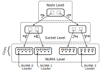

XPMEM Hierarchical Collectives (``xhc``)
========================================

Introduction
------------

The XHC component implements highly optimized intra-node MPI collectives using
hierarchical & topology-aware algorithms, while (mainly) utilizing XPMEM for
efficient data transfers between processes.

The following primitives are currently implemented:

    * MPI_Bcast
    * MPI_Allreduce
    * MPI_Reduce
    * MPI_Barrier

Using the xhc component
-----------------------

To enable the ``xhc`` component, simply set its priority higher than other
collectives components:

.. code-block:: sh
   
   $ mpirun --mca coll_xhc_priority 40 [...] <program> [...]

Main Features
-------------

Hierarchy
~~~~~~~~~

XHC constructs an *n*-level hierarchy (i.e. no limitation on number of levels),
based on intra-node topological features. Rank/process locality information
originates from Hwloc, and is obtained through Open MPI's internal structures.

The following topological features can currently be defined:

    * NUMA node
    * CPU Socket
    * L1/L2/L3 cache
    * Hwthread/core
    * Node (all ranks *are* in same node -> flat hierarchy)

An example of a 3-level XHC hierarchy (``numa,socket`` configuration):

Furthermore, support for virtual/user-defined hierarchies is available, to
allow for even finer control and custom experiments.

**Pipelining** is seamlessly applied across all levels of the hierarchy, to
minimize hierarchy-induced overheads, and to allow for interleaving of
operations in certain collectives (e.g. reduce+bcast in allreduce).

Single-copy data transfers
~~~~~~~~~~~~~~~~~~~~~~~~~~

XHC supports data transfers between MPI ranks using a single copy, through Open
MPI's ``opal/smsc`` (shared-memory-single-copy) framework. Despite the
component's name, XHC actually also supports additional single-copy mechanisms
in some collectives, though XPMEM is highly recommended.

    * Bcast: XPMEM, CMA, KNEM
    * Allreduce/Reduce: XPMEM
    * Barrier: *(irrelevant)*

In XPMEM mode, application buffers are attached on the fly the first time they
appear, and are saved in ``smsc/xpmem``'s internal registration cache for
future uses.

Shared-memory data transfers
~~~~~~~~~~~~~~~~~~~~~~~~~~~~

XHC also supports data transfers using copy-in-copy-out (CICO) over shared
memory. Copy-in-copy-out is always used for small messages, with automatic
switching to single-copy for large ones. All primitives support this mode,
regardless of XPMEM or SMSC presence, as long as the size of the message is
below the threshold.

Inline data transfers
~~~~~~~~~~~~~~~~~~~~~

For especially small messages, the payload data is inlined in the same cache
line as the control data. This achieves exceptionally low latency in such
messages. Supported in all primitives, regardless of XPMEM or SMSC presence.

Synchronization
~~~~~~~~~~~~~~~

XHC uses **lock-free** synchronization, using the single-writer paradigm and lightweight *read* or *write* memory barriers wherever appropriate.

Multi-node with HAN
-------------------

Even though ``xhc`` only works over shared memory, it may also be utilized in
multi-node environments, through ``coll/han``. HAN is already the default
component in multi-node runs, so all that's needed is to define ``xhc`` as the
component to be used for the intra-node phase:

.. code-block:: sh
   
   $ mpirun --mca coll_han_bcast_low_module 2 --mca coll_han_reduce_low_module 2 \
      --mca coll_han_allreduce_low_module 2 <program>

.. _mca-params:

MCA Parameters
--------------

Basic
~~~~~

.. list-table::
   :header-rows: 1
   :widths: 20 10 70
   
   * - Parameter
     - Default
     - Description
   
   * - coll_xhc_priority
     - 0
     - The priority of the component. Set it to a value higher than other
       components to enable xhc.

Main
~~~~

.. list-table::
   :header-rows: 1
   :widths: 20 20 60
   
   * - Parameter
     - Default
     - Description
   
   * - coll_xhc_hierarchy
     - *unset*
     - A comma separated list of topological features to which XHC's hierarchy
       should be sensitive. This is a hint -- xhc will automatically: disregard
       features that don't exist in the system, or that don't further segment
       the ranks (e.g. ``numa`` was specified, but all ranks are in the same
       NUMA node); re-order the list to match the system's hierarchy; add an
       extra top level that's common to all ranks. This parameter applies to
       all primitives, and is mutually exclusive with the primitive-specific
       ones below.
       
       This parameter also supports the use of special modifiers for *virtual
       hierarchies*. Check ``xhc_component_parse_hierarchy()`` for further
       explanation and syntax.
   
   * - coll_xhc_chunk_size
     - *unset*
     - The chunk size for the pipelining. Data is processed in this-much sized
       pieces at once. Applies to all primitives -- mutually exclusive with
       primitive-specific parameters.
   
   * - coll_xhc_cico_max
     - *unset*
     - The max size up to which to use copy-in-copy-out. Single copy will be
       used for messages above this size. Applies to all primitives -- mutually
       exclusive with primitive-specific parameters.
   
   * - coll_xhc_<op>_hierarchy
     - bcast/barrier: ``numa,socket``
       (all)reduce: ``l3,numa,socket``
     - Topological features to consider for XHC's hierarchy, specifially for
       this primitive. Mutually exclusive with the respective non-specific
       parameter.
   
   * - coll_xhc_<op>_chunk_size
     - 16K
     - Pipeline chunk size, specifically for this primitive. Mutually exclusive
       with the non-specific parameter.
   
   * - coll_xhc_<op>_cico_max
     - bcast: ``256``
       (all)reduce: ``4K``
     - Max size for copy-in-copy-out transfers, specifically for this
       primitive. Mutually exclusive with the non-specific parameter.

Advanced
~~~~~~~~

.. list-table::
   :header-rows: 1
   :widths: 20 20 60
   
   * - Parameter
     - Default
     - Description
   
   * - coll_xhc_<barrier/allreduce>_root
     - 0
     - Internal root rank, for either of these operations.
   
   * - coll_xhc_uniforms_chunks
     - true
     - Whether to dynamically adjust (decrease) the chunk size in reduction
       primitives, so that all ranks will perform equal work, depending on
       the message size.
   
   * - coll_xhc_uniforms_chunks_min
     - 4K
     - Minimum allowed value for the automatically decreased chunk size in
       reduction primitives.
   
   * - coll_xhc_reduce_load_balance
     - top,first
     - Controls load balancing features in reduction primitives. With no such
       features enabled, leader ranks don't perform any reduction work, on the
       levels on which they are leaders. Add ``top`` to have the root perform
       reductions on the top-most level of the hierarchy, as if a common rank.
       Add ``first``, to have all leaders reduce a single chunk, at the
       beginning of the operation as if they weren't leaders. Add ``all`` to
       have leaders always perform reductions, even on the levels on which they
       are leaders (not recommended).
   
   * - coll_xhc_dynamic_reduce
     - non-float
     - Controls support for out-of-order reduction (rank wise), which allows
       temporarily skipping a peer that's not yet ready. The default value only
       enables the feature for non-float types, to avoid reproducibility issues
       with floats. Set to ``disabled`` or ``all`` to turn off or on,
       respectively, for all types.
   
   * - coll_xhc_dynamic_leader
     - false
     - Dynamically elect the first rank from each hierarchy group to join the
       collective as its leader, in broadcast. Introduces an atomic
       compare-exchange per each call, when enabled.

Other
~~~~~

.. list-table::
   :header-rows: 1
   :widths: 20 20 60
   
   * - Parameter
     - Default
     - Description
   
   * - coll_xhc_shmem_backing
     - /dev/shm
     - Backing directory for shmem files.
   
   * - coll_xhc_memcpy_chunk_size
     - 256K
     - Break up large memcpy calls to smaller ones, using this chunk size.
       Will actually attempt to mirror the value of ``smsc/xpmem``'s respective
       parameter at run-time.

Debug
~~~~~

.. list-table::
   :header-rows: 1
   :widths: 25 15 60
   
   * - Parameter
     - Default
     - Description
   
   * - coll_xhc_print_info
     - *none*
     - Print information about the component's configuration, and its
       constructed hierarchies. Takes a comma delimited list of: the name of
       the collective primitive about which to print information; ``config``
       to print the configuration; ``all`` to print everything; ``dot`` along
       with the name of a collective primitive to print its hierarchy in DOT
       format.

Limitations
-----------

* **Heterogeneity**: XHC does not support nodes with non-uniform
  datatype representations across ranks (Open MPI's ``proc_arch``).

* **Non-commutative** operators are not currently supported in
  reduction collectives.

* **Derived datatypes** are not yet supported.

* The Reduce implementation only supports rank 0 as the root, and will
  automatically fall back to another component in other scenarios. Work in
  progress.

Other resources
---------------

All things XHC landing page: https://github.com/CARV-ICS-FORTH/XHC-OpenMPI

Publications
~~~~~~~~~~~~

.. **Publications**

| **A framework for hierarchical single-copy MPI collectives on multicore nodes**
| *George Katevenis, Manolis Ploumidis, and Manolis Marazakis*
| Cluster 2022, Heidelberg, Germany
| https://ieeexplore.ieee.org/document/9912729

| **Impact of Cache Coherence on the Performance of Shared-Memory based MPI Primitives: A Case Study for Broadcast on Intel Xeon Scalable Processors**
| *George Katevenis, Manolis Ploumidis, and Manolis Marazakis*
| ICPP 2023, Salt Lake City, Utah, USA
| https://dl.acm.org/doi/10.1145/3605573.3605616
