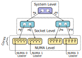

# XHC: XPMEM-based Hierarchical Collectives

The XHC component, implements hierarchical & topology-aware intra-node MPI
collectives, utilizing XPMEM in order to achieve efficient shared address space
memory access between processes.

## Main features

* Constructs an **n-level hierarchy** (i.e. no algorithmic limitation on level
count), following the system's hardware topology. Ranks/processes are grouped
together according to their relative locations; this information is known
thanks to Hwloc, and is obtained via OpenMPI's integrated book-keeping.

    Topological features that can currently be defined (configurable via MCA params):

    - NUMA node
    - CPU Socket
    - L1, L2, L3 cache
    - Hwthread, core
    - Node/flat (no hierarchy)

    Example of a 3-level XHC hierarchy (sensitivity to numa & socket locality):

    

    Furthermore, support for custom virtual user-defined hierarchies is
    available, to aid when fine-grained control over the communication pattern
    is necessary.

* Support for both **zero-copy** and **copy-in-copy-out** data transportation.
    - Switchover at static but configurable message size.

    - CICO buffers permanently attached at module initialization

    - Application buffers attached on the fly the first time they appear, saved
    on and recovered from registration cache in subsequent appearances.
    (assuming smsc/xpmem)

* Integration with Open MPI's `opal/smsc` (shared-memory-single-copy)
framework. Selection of `smsc/xpmem` is highly recommended.

    - Bcast support: XPMEM, CMA, KNEM
    - Allreduce support: XPMEM
    - Barrier support: *(all, irrelevant)*

* Data-wise **pipelining** across all levels of the hierarchy allows for
lowering hierarchy-induced start-up overheads. Pipelining also allows for
interleaving of operations in some collectives (reduce+bcast in allreduce).

* **Lock-free** single-writer synchronization, with cache-line separation where
necessary/beneficial. Consistency ensured via lightweight memory barriers.

## Configuration options -- MCA params

XHC can be customized via a number of standard Open MPI MCA parameters, though
defaults that should satisfy a wide number of systems are in place.

The available parameters:

#### *(prepend with "coll_xhc_")*
*(list may be outdated, please also check `ompi_info` and `coll_xhc_component.c`)*

* **priority** (default `0`): The priority of the coll/xhc component, used
during the component selection process.

* **print_info** (default `false`): Print information about XHC's generated
hierarchy and its configuration.

* **shmem_backing** (default `/dev/shm`): Backing directory for shmem files
used for XHC's synchronization fields and CICO buffers.

* **dynamic_leader** (default `false`): Enables the feature that dynamically
elects an XHC group leader at each collective (currently only applicable
to bcast).

* **dynamic_reduce** (default `1`=`non-float`): Controls the
feature that allows for out-of-order reduction. XHC ranks reduce chunks
directly from multiple peers' buffers; dynamic reduction allows them to
temporarily skip a peer when the expected data is not yet prepared, instead of
stalling. Setting to `2`=`all`, might/will harm reproducibility of float-based
reductions.

* **coll_xhc_lb_reduce_leader_assist** (default `top,first`): Controls the
leader-to-member load balancing mode in reductions. If set to none/empty (`""`)
only non-leader group members perform reductions. With `top` in the list, the
leader of the top-most level also performs reductions in his group. With
`first` in the list, leaders will help in the reduction workload for just one
chunk at the beginning of the operation. If `all` is specified, all group
members, including the leaders, perform reductions indiscriminately.

* **force_reduce** (default `false`): Force enable the "special" Reduce
implementation for all calls to MPI_Reduce. This implementation assumes that
the `rbuf` parameter to MPI_Reduce is valid and appropriately sized for all
ranks; not just the root -- you have to make sure that this is indeed the case
with the application at hand. Only works with `root = 0`.

* **hierarchy** (default `"numa,socket"`): A comma separated list of
topological feature to which XHC's hierarchy-building algorithm should be
sensitive. `ompi_info` reports the possible values for the parameter.

    - In some ways, this is "just" a suggestion. The resulting hierarchy may
    not exactly match the requested one. Reasons that this will occur:

        - A requested topological feature does not effectively segment the set
        of ranks. (eg. `numa` was specified, but all ranks reside in the same
        NUMA node)

        - No feature that all ranks have in common was provided. This a more
        intrinsic detail, that you probably don't need to be aware of, but you
        might come across if eg. you investigate the output of `print_info`. An
        additional level will automatically be added in this case, no need to
        worry about it.

            For all intents and purposes, a hierarchy of `numa,socket` is
            interpreted as "segment the ranks according to NUMA node locality,
            and then further segment them according to CPU socket locality".
            Three groups will be created: the intra-NUMA one, the intra-socket
            one, and an intra-node one.

        - The provided features will automatically be re-ordered when their
        order does not match their order in the physical system. (unless a
        virtual hierarchy feature is present in the list)

    - *Virtual Hierarchies*: The string may alternatively also contain "rank
    lists" which specify exactly which ranks to group together, as well as some
    other special modifiers. See in
    `coll_xhc_component.c:xhc_component_parse_hierarchy()` for further
    explanation as well as syntax information.

* **chunk_size** (default `16K`): The chunk size for the pipelining process.
Data is processed (eg broadcast, reduced) in this-much sized pieces at once.

    - It's possible to have a different chunk size for each level of the
    hierarchy, achieved via providing a comma-separated list of sizes (eg.
    `"16K,16K,128K"`) instead of single one. The sizes in this list's *DO NOT*
    correspond to the items on hierarchy list; the hierarchy keys might be
    re-ordered or reduced to match the system, but the chunk sizes will be
    consumed in the order they are given, left-to-right -> bottom-to-top.

* **uniform_chunks** (default `true`): Automatically optimize the chunk size
in reduction collectives, according to the message size, so that all members
will perform equal work.

* **uniform_chunks_min** (default `1K`): The lowest allowed value for the chunk
size when uniform chunks are enabled. Each worker will reduce at least this much
data, or we don't bother splitting the workload up.

* **cico_max** (default `1K`): Copy-in-copy-out, instead of single-copy, will be
used for messages of *cico_max* or less bytes.

*(Removed Parameters)*

* **rcache_max**, **rcache_max_global** *(REMOVED with shift to opal/smsc)*:
Limit to number of attachments that the registration cache should hold.

    - A case can be made about their usefulness. If desired, should be
    re-implemented at smsc-level.

## Limitations

- *Intra-node support only*
    - Usage in multi-node scenarios is possible via OpenMPI's HAN.

- **Heterogeneity**: XHC does not support nodes with non-uniform (rank-wise)
datatype representations. (determined according to `proc_arch` field)

- **Non-commutative** operators are not supported by XHC's reduction
collectives. In past versions, they were supported, but only with the flat
hierarchy configuration; this could make a return at some point.

- XHC's Reduce is not fully complete. Instead, it is a "special" implementation
of MPI_Reduce, that is realized as a sub-case of XHC's Allreduce.

    - If the caller guarantees that the `rbuf` parameter is valid for all ranks
    (not just the root), like in Allreduce, this special Reduce can be invoked
    by specifying `root=-1`, which will trigger a Reduce to rank `0` (the only
    one currently supported).

        - Current prime use-case: HAN's Allreduce

    - Furthermore, if it is guaranteed that all Reduce calls in an application
    satisfy the above criteria, see about the `force_reduce` MCA parameter.

    - XHC's Reduce is not yet fully optimized for small messages.

## Building

XHC is built as a standard mca/coll component.

To reap its full benefits, XPMEM support in OpenMPI is required. XHC will build
and work without it, but the reduction operations will be disabled and
broadcast will fall-back to less efficient mechanisms (CMA, KNEM).

## Running

In order for the XHC component to be chosen, make sure that its priority is
higher than other components that provide the collectives of interest; use the
`coll_xhc_priority` MCA parameter. If a list of collective modules is included
via the `coll` MCA parameter, make sure XHC is in the list.

* You may also want to add the `--bind-to core` param. Otherwise, the reported
process localities might be too general, preventing XHC from correctly
segmenting the system. (`coll_xhc_print_info` will report the generated
hierarchy)

### Tuning

* Optional: You might wish to manually specify the topological features that
XHC's hierarchy should conform to. The default is `numa,socket`, which will
group the processes according to NUMA locality and then further group them
according to socket locality. See the `coll_xhc_hierarchy` param.

    - Example: `--mca coll_xhc_hierarchy numa,socket`
    - Example: `--mca coll_xhc_hierarchy numa`
    - Example: `--mca coll_xhc_hierarchy flat`

    In some systems, small-message Broadcast or the Barrier operation might
    perform better with a flat tree instead of a hierarchical one. Currently,
    manual benchmarking is required to accurately determine this.

* Optional: You might wish to tune XHC's chunk size (default `16K`). Use the
`coll_xhc_chunk_size` param, and try values close to the default and see if
improvements are observed. You may even try specifying different chunk sizes
for each hierarchy level -- use the same process, starting from the same chunk
size for all levels and decreasing/increasing from there.

    - Example: `--mca coll_xhc_chunk_size 16K`
    - Example: `--mca coll_xhc_chunk_size 16K,32K,128K`

* Optional: If you wish to focus on latencies of small messages, you can try
altering the cico-to-zcopy switchover point (`coll_xhc_cico_max`, default
`1K`).

    - Example: `--mca coll_xhc_cico_max 1K`

* Optional: If your application is heavy in Broadcast calls and you suspect
that specific ranks might be joining the collective with delay and causing
others to stall waiting for them, you could try enabling dynamic leadership
(`coll_xhc_dynamic_leader`), and seeing if it marks an improvement.

    - Example: `--mca coll_xhc_dynamic_leader 1`

### Example command lines

*Assuming `PATH` and `LD_LIBRARY_PATH` have been set appropriately.*

Default XHC configuration:  
`$ mpirun --mca coll libnbc,basic,xhc --mca coll_xhc_priority 100 --bind-to core <application>`

XHC w/ numa-sensitive hierarchy, chunk size @ 16K:  
`$ mpirun --mca coll libnbc,basic,xhc --mca coll_xhc_priority 100 --mca coll_xhc_hierarchy numa --mca coll_xhc_chunk_size 16K --bind-to core <application>`

XHC with flat hierarchy (ie. none at all):  
`$ mpirun --mca coll libnbc,basic,xhc --mca coll_xhc_priority 100 --mca coll_xhc_hierarchy node [--bind-to core] <application>`

## Publications

1. **A framework for hierarchical single-copy MPI collectives on multicore nodes**,  
*George Katevenis, Manolis Ploumidis, Manolis Marazakis*,  
IEEE Cluster 2022, Heidelberg, Germany.  
https://ieeexplore.ieee.org/document/9912729

## Contact

- George Katevenis (gkatev@ics.forth.gr)
- Manolis Ploumidis (ploumid@ics.forth.gr)

Computer Architecture and VLSI Systems (CARV) Laboratory, ICS Forth

##  Acknowledgments

We thankfully acknowledge the support of the European Commission and the Greek
General Secretariat for Research and Innovation under the EuroHPC Programme
through the **DEEP-SEA** project (GA 955606). National contributions from the
involved state members (including the Greek General Secretariat for Research
and Innovation) match the EuroHPC funding.

This work is partly supported by project **EUPEX**, which has received funding
from the European High-Performance Computing Joint Undertaking (JU) under grant
agreement No 101033975. The JU receives support from the European Union's
Horizon 2020 re-search and innovation programme and France, Germany, Italy,
Greece, United Kingdom, Czech Republic, Croatia.
