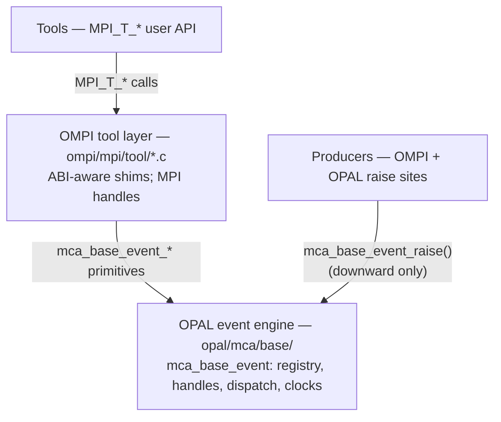
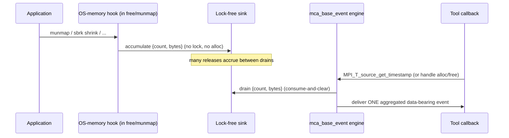

# MPI_T events implementation specification

This document specifies Open MPI's implementation of the MPI tool
information interface ("MPI_T") *events* facility defined in MPI-5.0
§15.3.8. It describes the current state of the implementation: the OPAL
event engine, the OMPI tool-layer bindings, the built-in event
producers (including events bound to specific MPI objects), and the
invariants the implementation guarantees. Section numbers in this
document are referenced from the source code (e.g. `sec. 5.10`).

Citations of the form "MPI-5.0 §15.3.8" or "MPI-5.0 p.751" refer to the
MPI-5.0 standard; they mark behavior the standard *requires*, *permits*,
or otherwise governs.

---

## 1. Overview and scope

The MPI_T events facility lets a tool register callbacks that the MPI
implementation invokes when it *raises* an event. Each event instance
carries a timestamp, originates from a *source* (a clock-and-ordering
domain), and conveys a typed data payload (MPI-5.0 §15.3.8).

Open MPI implements the full set of MPI_T event entry points and ships a
set of built-in event sources and event types. That built-in set is an
initial, deliberately non-exhaustive collection — implemented largely as
worked examples and to exercise the infrastructure — and may grow over
time. Tools must discover the available sources and events at run time
(MPI-5.0 §15.3.8); they must not hard-code names.

In scope:

- The OPAL `mca_base_event` engine (`opal/mca/base/mca_base_event*.[ch]`).
- The OMPI MPI_T tool-layer entry points (`ompi/mpi/tool/`).
- The built-in producers (`ompi/runtime/ompi_mpit_*`, plus raise sites
  in `ompi/communicator`, `ompi/win`, `ompi/errhandler`, `ompi/instance`,
  `ompi/runtime`).
- `ompi_info --event` integration.

Out of scope: control variables and performance variables (MPI-5.0
§15.3.6–15.3.7), which share the underlying `mca_base_var`/`mca_base_pvar`
machinery but are separate interfaces.

---

## 2. Standard background

MPI-5.0 §15.3.8 defines the events model. The salient points the
implementation must honor:

- **Sources** (MPI-5.0 §15.3.8, `MPI_T_source_get_num` /
  `MPI_T_source_get_info` / `MPI_T_source_get_timestamp`): each source is
  a clock with an ordering guarantee. `MPI_T_source_get_info` reports the
  source's `ordering` (`MPI_T_SOURCE_ORDERED` vs `_UNORDERED`),
  `ticks_per_second`, and `max_ticks`. Timestamps are only meaningful
  *within* a source.
- **Event types** (`MPI_T_event_get_num` / `_get_info` / `_get_index`):
  each event type has an index, a name, a verbosity level, an ordered
  list of typed payload elements (`array_of_datatypes`), and a *binding*
  (`bind`) naming the class of MPI object it is associated with, or
  `MPI_T_BIND_NO_OBJECT`.
- **Registration handles** (`MPI_T_event_handle_alloc` /
  `_handle_free`): a tool allocates a registration handle for an event
  type, optionally bound to a specific MPI object via `obj_handle`
  (MPI-5.0 p.751). For a `MPI_T_BIND_NO_OBJECT` event, `obj_handle` is
  ignored.
- **Callbacks** (`MPI_T_event_register_callback`): a tool installs a
  callback at a *callback-safety level* (`MPI_T_CB_REQUIRE_NONE`,
  `_MPI_RESTRICTED`, `_THREAD_SAFE`, `_ASYNC_SIGNAL_SAFE`). The callback
  signature is `(MPI_T_event_instance, MPI_T_event_registration,
  MPI_T_cb_safety, void *user_data)`. The bound object is *not* a
  callback argument; the registration handle identifies it (MPI-5.0
  §15.3.8).
- **Reading data** (`MPI_T_event_read` / `MPI_T_event_copy`): inside the
  callback, the tool reads individual payload elements or copies the
  whole buffer. The event instance is valid only for the duration of the
  callback.
- **Dropped events** (`MPI_T_event_set_dropped_handler`): if the
  implementation cannot deliver an event, it may instead count it as
  dropped and report the count to a dropped-event handler.
- **Timestamps** (`MPI_T_event_get_timestamp`, `MPI_T_source_get_timestamp`):
  the per-instance timestamp and the ad-hoc source clock read share the
  source's clock.

---

## 3. Architecture

The implementation respects the OPAL → OMPI layering:

- The **OPAL engine** (`mca_base_event`) owns the event/source
  registries, registration handles, the dispatch path, drop accounting,
  the instance pool, and clocks. It knows nothing about MPI types; object
  identities are opaque `void *` tokens to it.
- The **OMPI tool layer** implements the public `MPI_T_event_*` and
  `MPI_T_source_*` functions as thin shims over the engine, translating
  between MPI handles/types and the engine's primitives, and mapping OPAL
  return codes to `MPI_T_ERR_*`.
- **Producers** are the in-tree raise sites. Core producers register
  through `ompi_mpit_register_events()` (`ompi/runtime/`). Each raise site
  is a guarded call to `mca_base_event_raise()` (or
  `mca_base_event_raise_bound()`, sec. 6.1).

The OPAL engine never calls upward; the OS memory producer reaches OMPI's
registration only by being *registered from* OMPI and *driven by* an OPAL
hook plus a callback installed downward (sec. 7.1).

---

## 4. Sources

The built-in producers advertise their events on two sources, split by
the single source-visible property that differs between them — *ordering*
(MPI-5.0 §15.3.8, `MPI_T_source_get_info`). A source is fundamentally a
clock-and-ordering domain, not a subsystem grouping; event names and
MPI_T categories already group by subsystem.

- **`ompi`** — `MPI_T_SOURCE_ORDERED`. Carries all individually
  timestamped lifecycle events (initialization/finalization,
  communicator, RMA window, error-handler). Successive timestamps are
  monotonically non-decreasing, so a tool can order events by timestamp.
- **`ompi.unordered`** — `MPI_T_SOURCE_UNORDERED`. Carries events whose
  underlying occurrences are aggregated before delivery, so
  per-occurrence chronology is not preserved (currently just the OS
  memory-release event, sec. 7.1). Registered only where the OPAL
  memory-release hooks are available.

Both use Open MPI's default event clock — the same underlying system
clock that backs `MPI_Wtime` — with `ticks_per_second` = 1,000,000,000
(nanoseconds) and `max_ticks` = the largest `MPI_Count`. Both support
ad-hoc timestamp reads (sec. 5.8).

**Timestamps are only comparable within one source** (MPI-5.0 §15.3.8).
Event timestamps are also *not* directly comparable to `MPI_Wtime`: same
clock and rate, but integer nanoseconds vs. double seconds and a
different, lazily-captured origin. The standard requires no relationship
between the two.

---

## 5. The OPAL event engine (`mca_base_event`)

### 5.1 Event and source registries

`mca_base_event_register()` and `mca_base_event_source_register()`
populate global registries indexed by a dense integer (the event/source
*index* exposed to tools). Registration is **idempotent by name**: a
repeated registration of the same name returns the existing index. This
lets `ompi_mpit_register_events()` be called from several paths
(`ompi_info`, instance init, `MPI_T_init_thread`) without duplicating
entries. Event-type names are forced into the `ompi.` namespace by the
registration helper.

`mca_base_event_get_by_index()` / `_source_get_by_index()` /
`_get_count()` provide lookup, backing `MPI_T_event_get_num` /
`_get_index` / `_get_info` and the source equivalents.

### 5.2 Registration handles

A registration handle (`mca_base_event_registration_t`) is the engine's
representation of one `MPI_T_event_handle_alloc` result. It records the
event it belongs to, its bound object identity (NULL for a
`NO_OBJECT` event, sec. 6.1), a reference count, a liveness flag, the
installed callbacks (one slot per safety level, sec. 5.12), the
dropped-event handler slot, and an atomic dropped-event counter
(sec. 5.4).

### 5.3 Callbacks and user data

`mca_base_event_register_callback()` installs a callback at a given
safety level with an opaque `user_data` and an optional context-release
callback. Re-registering replaces the slot. The callback is invoked with
the event instance, the registration handle, the actual delivery safety
level, and `user_data` (MPI-5.0 §15.3.8). Because the bound object is not
a callback argument, a tool that binds to an object typically stashes it
in `user_data`.

### 5.4 Drop accounting

When an event cannot be delivered to a registration, the engine
increments that registration's atomic dropped counter rather than
losing the fact silently (MPI-5.0 §15.3.8 permits counting drops). The
count is captured and cleared atomically at the next successful delivery
and reported to the dropped-event handler (sec. 5.5). The counter is a
64-bit value; before being narrowed for delivery it is **saturated** to a
ceiling so a near-overflow or already-wrapped value cannot become
negative or wrap (`mca_base_event_saturate_to`).

### 5.5 Dropped-event handlers

`mca_base_event_set_dropped_handler()` installs a per-registration
handler (`MPI_T_event_set_dropped_handler`). The captured drop count is
**flushed to the handler immediately before the next successful
delivery** to the same registration, so a callback never observes a
delivery that silently elides earlier drops. A registration may carry a
dropped handler with no event callback; it then observes each aggregated
batch from a deferred-release source as a single dropped event
(sec. 7.1).

### 5.6 Reading payload elements

`mca_base_event_read()` (backing `MPI_T_event_read`) copies one typed
element out of the instance buffer at the registered offset;
`mca_base_event_copy()` copies the whole buffer (`MPI_T_event_copy`).
Reads are by `memcpy` (no aligned-load assumption), so the payload buffer
need not be naturally aligned. The instance is valid only inside the
callback invocation (MPI-5.0 §15.3.8).

### 5.7 Clocks

Sources advertise a `ticks_per_second` and `max_ticks`
(`MPI_T_source_get_info`). The built-in producers use the default clock
(`opal_clock_gettime`), the same backend as `MPI_Wtime`, reported in
integer nanoseconds. The clock origin is captured lazily.

### 5.8 Ad-hoc timestamps

`MPI_T_source_get_timestamp` lets a tool sample a source's clock on
demand, independent of any event, and compare the result to event
timestamps *from the same source* (MPI-5.0 §15.3.8). Both built-in
sources support ad-hoc reads because the default clock is freely
readable. For a deferred-release source, the ad-hoc read is also the
primary moment at which the engine drains the source's sink and delivers
its aggregated event (sec. 7.1).

### 5.9 Dispatch safety

The raise path (`mca_base_event_raise_internal`) is engineered to be safe
to call from arbitrary normal-context producers:

- **Recursion-depth gate.** A per-thread dispatch-depth counter is
  checked at entry; if a callback re-raises the event (or any event)
  beyond a bounded depth, the raise is skipped, preventing unbounded
  recursion.
- **Snapshot-then-invoke.** Under the engine lock, the live, matching
  registrations are *snapshotted* into a small array (inline for the
  common case, heap-grown if needed); the lock is dropped before any
  callback runs. Callbacks therefore never run under the engine lock,
  so a callback may freely re-enter the MPI_T interface.
- **Heap-fallback OOM.** If growing the snapshot fails, the current and
  remaining matching registrations are credited a drop (sec. 5.4) within
  the same lock hold, and snapshotting stops, rather than risking an
  inconsistent dispatch.
- **Instance-pool exhaustion.** If no event instance can be acquired
  (sec. 12.4), the captured drop counts are restored (saturating,
  sec. 5.4) and no callback runs.

### 5.10 Registration-handle lifetime

Handles are reference-counted and freed via a **deferred-free** scheme so
a callback can free its own handle safely (MPI-5.0 §15.3.8 requires
free-from-callback to be legal):

- A live-handle hash table keyed by the pointer *value* validates handles
  without dereferencing them, so a lookup on a stale pointer is safe.
- `mca_base_event_handle_free()` marks the handle dead and drops the
  creator's reference; the memory is reclaimed only once the last
  reference (e.g. an in-flight dispatch snapshot, or the callback that
  is freeing itself) is gone.
- A double free is rejected (the handle validates as not-live).
- Using a handle after its bound object is freed is erroneous tool
  behavior (sec. 6.1); the engine's by-value validation guarantees it
  never dereferences freed memory, but it cannot detect address reuse, so
  the standard's "do not use a freed handle" rule applies.
- For a deferred-release source, `handle_free` first drains pending
  releases to the still-live registration (sec. 7.1), so a tool that
  frees without a final ad-hoc read still observes the last batch.

### 5.11 Timestamps and ordering

For an `MPI_T_SOURCE_ORDERED` source, the engine enforces a per-source
**monotonicity backstop**: a delivered timestamp is never less than the
previous one from the same source, even across a non-monotonic clock
read, preserving the ordering guarantee `MPI_T_source_get_info` advertises
(MPI-5.0 §15.3.8). Unordered sources make no such guarantee.

### 5.12 Callback safety levels

A callback is registered at one of the MPI-5.0 safety levels
(`MPI_T_CB_REQUIRE_NONE` < `_MPI_RESTRICTED` < `_THREAD_SAFE` <
`_ASYNC_SIGNAL_SAFE`). A raise carries the safety level of its calling
context; the engine selects, for each registration, the most capable
installed callback that is **no stricter** than the raise context (i.e.
it never invokes a callback that requires more safety than the context
provides). This release delivers only in normal contexts (`NONE`,
`MPI_RESTRICTED`, `THREAD_SAFE`); an `ASYNC_SIGNAL_SAFE` callback is
accepted but never selected, because no producer raises from an
async-signal context. That is conformant: the standard permits an
implementation never to deliver at a level it does not support.

---

## 6. Event type definitions and payloads

An event type is registered with an ordered list of fixed, exact-width
typed elements (`MCA_BASE_VAR_TYPE_INT32_T`, `_UINT64_T`, `_INT64_T`,
etc.) at ascending offsets starting at 0; the computed buffer size must
not exceed `MCA_BASE_EVENT_MAX_PAYLOAD` (sec. 9.1). The element list is
reported to tools as `array_of_datatypes` by `MPI_T_event_get_info`
(MPI-5.0 §15.3.8). A producer's raise-time payload `struct` must match
the registered offsets exactly; a trailing `uint64` handle is placed at
its natural 8-byte alignment so struct and offsets agree.

Object handles carried in payloads are the C handle / internal object
pointer as a `uint64` — an opaque correlation token (e.g. pairing a
"created" event with its "freed", or a "finalization" with its
"initialization"). It must not be dereferenced by the tool. Its
representation depends on the tool's MPI ABI (sec. 10).

### 6.1 Object binding

An event type's *binding* (`bind`, reported by `MPI_T_event_get_info`)
names the class of MPI object the event is associated with, or
`MPI_T_BIND_NO_OBJECT` (MPI-5.0 §15.3.8). The engine stores `bind` as an
`MCA_BASE_VAR_BIND_*` value whose enumeration mirrors the public
`MPI_T_BIND_*` ordering, so the tool layer reports it verbatim.

**Semantics.** An event type is *either* `NO_OBJECT` *or* bound to one
object class — the `bind` value is fixed per event type. There is no
"bind, or all" mode:

- For a `NO_OBJECT` event, `MPI_T_event_handle_alloc` ignores
  `obj_handle` (MPI-5.0 p.751), and a single registration observes every
  instance.
- For a bound event, a tool passes the *address of the object's handle*
  as `obj_handle`; the registration is then notified **only** when the
  event occurs for that specific object. To watch several objects, a tool
  allocates one registration per object.

**Resolution.** `mca_base_event_handle_alloc` resolves the bound-object
identity once, at allocation: for a `NO_OBJECT` event it stores NULL; for
a bound event it dereferences `obj_handle` (the "address to a local
variable that stores the object's handle", MPI-5.0 p.751) to the identity
a producer will raise with, and rejects a NULL `obj_handle`
(`OPAL_ERR_BAD_PARAM` → `MPI_T_ERR_INVALID_HANDLE`). The stored identity
is opaque to OPAL and is only ever compared by value, never dereferenced.

**Dispatch filter.** A producer raises a bound event with
`mca_base_event_raise_bound(event, source, obj, data)`, passing the
object identity (e.g. an `ompi_communicator_t *`). The dispatch snapshot
(sec. 5.9) delivers to a registration iff its stored bound identity
equals the raised object. The same comparison serves `NO_OBJECT` events
uniformly: both the raised object and every registration's stored
identity are NULL, so all match. A non-matching bound registration is
*skipped*, not credited a drop — the event was not for it.

**Callback.** The bound object is not a callback argument (MPI-5.0
§15.3.8); the tool knows it (it bound to it) and typically records it in
`user_data`. A bound event whose payload would merely echo the bound
object carries only the minimal data a callback needs and lets the
callback query further detail from the object directly.

**Lifetime.** Binding a registration to an object the tool later frees,
then continuing to use the registration, is erroneous (sec. 5.10): the
engine never dereferences the stored identity, but it cannot detect
address reuse.

---

## 7. Built-in producers

Core producers are registered by `ompi_mpit_register_events()`, gated by
the MCA parameter `mca_base_event_register_producers` (default on) and by
per-facility availability (sec. 5; absent facilities simply yield a
smaller, still-conformant event set). The current set:

| Event type | Source | Bind | Payload |
|---|---|---|---|
| `ompi.mpi.initialization` | `ompi` | NO_OBJECT | model, thread_level, world_rank, world_size, instance_id |
| `ompi.mpi.finalization` | `ompi` | NO_OBJECT | model, world_rank, instance_id |
| `ompi.mpi.communicator_created` | `ompi` | NO_OBJECT | size, handle |
| `ompi.mpi.communicator_freed` | `ompi` | NO_OBJECT | handle |
| `ompi.mpi.communicator_name_set` | `ompi` | **MPI_COMM** | handle |
| `ompi.mpi.errhandler_invoked` | `ompi` | NO_OBJECT | err_code, object_type, errhandler_handle, object_handle |
| `ompi.mpi.win_created` | `ompi` | NO_OBJECT | size, disp_unit, flavor, handle |
| `ompi.mpi.win_freed` | `ompi` | NO_OBJECT | flavor, handle |
| `ompi.mca.memory.patcher.released` | `ompi.unordered` | NO_OBJECT | count, bytes |

Notes:

- **initialization / finalization** fire for *both* MPI models, which
  share the internal instance path. `model` is `OMPI_T_MODEL_WORLD` or
  `OMPI_T_MODEL_SESSION` (public enums in `<mpi.h>`). `world_rank` /
  `world_size` are meaningful only for the world model and are `-1`
  otherwise (a process has no rank in a session). `instance_id`
  correlates a finalization with its initialization. The world-model
  initialization fires during `MPI_Init` once `MPI_COMM_WORLD` exists, so
  a tool must attach before `MPI_Init` to observe it.
- **communicator_name_set** is the bound event (sec. 6.1): raised from
  `MPI_Comm_set_name` after the lock is dropped (so a callback may
  re-enter MPI on the communicator). The new name is not in the payload;
  a callback reads it with `MPI_Comm_get_name` on the bound communicator.
- **errhandler_invoked** reports `object_type` as the `MPI_T_BIND_*` kind
  of the object the handler runs on (`NO_OBJECT` for a predefined handler
  or none, else `MPI_COMM` / `MPI_WIN` / `MPI_FILE` / `MPI_SESSION`),
  plus the errhandler handle and the object handle (each `0` when not
  available). This event is `NO_OBJECT` (it reports all errors and lets a
  tool filter by handle); a per-errhandler bound variant is a possible
  future addition, not a replacement.
- Raise sites are guarded by a NULL check on the event handle (NULL until
  registered) and pay almost nothing when no tool listens (sec. 5.9).

### 7.1 Deferred-release aggregation (OS memory)

The OS memory-release producer cannot deliver from its raise context. Its
hook — the OPAL "patcher" memory component intercepting `munmap`,
`mremap`, `madvise`, `brk`/`sbrk` shrink, and SysV `shmdt` — runs *inside*
the intercepted call, where it may not lock, allocate, or walk data
structures. Therefore:

- The hook only **accumulates** `{count, bytes}` into a lock-free,
  never-freed sink (`mca_base_event_memory.c`).
- The engine **drains** that sink and delivers one aggregated,
  data-bearing event at the next safe operation — notably an ad-hoc
  `MPI_T_source_get_timestamp` read of `ompi.unordered` (sec. 5.8), and
  also event-handle allocation/free (sec. 5.10).
- The drain happens **before any registration-set change** (a new
  registration must not receive an aggregate covering releases that
  predate it; a freeing registration must receive its final batch).
- A registration with only a dropped handler observes each aggregated
  batch as one dropped event (sec. 5.5).

Two properties follow from relying on these hooks. They are *chunk-level*
(they fire only when memory is actually returned to the OS, not on every
`free`), and they cannot distinguish the releasing API, so the payload is
a coarse `{count, bytes}` aggregate. A per-API breakdown and capture of
individual freed addresses are deliberately not provided: they would
require extending the memory-hook interface and, for addresses,
allocating in a context where allocation is unsafe.

This is wired across the layers without an upward call: the source/event
are registered in OMPI; the hook and sink live in OPAL; OMPI installs the
drain via `mca_base_event_memory_attach()` and a consume callback handed
downward.

---

## 8. `ompi_info` integration

`ompi_info --event` lists the registered sources and event types
(triggering `ompi_mpit_register_events()` via the normal MCA registration
path, sec. 5.1). Each event's name, source, level, binding, and element
layout is dumped in both parsable and human-readable forms via
`mca_base_event_dump()` / `mca_base_event_source_dump()`. This is the
command-line counterpart to run-time discovery with the MPI_T API.

---

## 9. Robustness

### 9.1 Registration cap (denial-of-service guard)

The number of simultaneously live registrations is capped by the
user-settable MCA parameter `mca_base_event_max_registrations`. The cap
is clamped to a sane range before use, because it also bounds the
dispatch snapshot capacity arithmetic (sec. 5.9); an attempt to exceed it
fails `MPI_T_event_handle_alloc` with `MPI_T_ERR_OUT_OF_HANDLES`. The
per-event payload size is likewise bounded by `MCA_BASE_EVENT_MAX_PAYLOAD`
(sec. 6). These bounds prevent a buggy or hostile tool from exhausting
memory through unbounded registration or oversized payloads.

---

## 10. MPI ABI considerations

Open MPI is gaining a second MPI ABI (the MPI Standard ABI, open-mpi/ompi
#13280) alongside its native ABI. The two represent MPI object handles
differently: the Open MPI ABI uses the internal object pointer; the
Standard ABI uses an integer handle. A process links exactly one ABI.

This affects the object handles carried in payloads (sec. 6) and the
bound-object resolution (sec. 6.1), because both must match the ABI of
the tool that registered the callback:

- A process-global flag `ompi_mpit_callback_abi`
  (`OMPI_MPIT_ABI_OMPI` / `_STANDARD`) records which ABI the registering
  tool uses. It is set by `MPI_T_event_register_callback` and is, for now,
  hard-coded to the Open MPI ABI.
- Each handle-emitting raise site branches on this flag. The Open MPI ABI
  branch emits the internal pointer; the Standard ABI branch is a marked
  `TODO ABI` stub (handle `0`) that #13280 will fill in.
- Bound-object resolution (sec. 6.1) dereferences the tool's `obj_handle`
  to the internal identity; under the Open MPI ABI the MPI handle *is*
  that pointer, so a single deref suffices. The Standard ABI must convert
  its integer handle to the internal pointer there (marked `XXX ABI`).

Because the engine's `mca_base_event_read` is a raw `memcpy` with no ABI
translation, a tool always reads back the representation the producer
emitted; matching the emitted representation to the tool's ABI is the
producer's responsibility, hence the per-raise-site branch.

---

## 11. Testing

- **White-box engine test** (`test/util/mca_base_event_test.c`, run under
  `make check`): exercises registration, delivery, payload reads,
  timestamps, drop accounting and dropped-handler flush, deferred-release
  folding, handle lifetime (self-free, double-free), the registration
  cap, dump routines, and **object binding** (a bound event reaches only
  the registration bound to the raised object; a NULL `obj_handle` is
  rejected; an unbound object reaches no one).
- **MPI-level tests** (`ompi/test/t/`, run as singletons under
  `make check`): producer coverage for the session model
  (`mpi_t_event_producers.c`) and the world model
  (`mpi_t_event_world.c`); object binding end-to-end via
  `MPI_Comm_set_name` (`mpi_t_event_comm_name.c`, confirming bound
  delivery isolation, the payload handle, and name re-query); plus
  smoke/self/reinit/inert tests.

---

## 12. Implementation internals

### 12.1 Locking

A single engine mutex (`mca_base_event_lock`) guards the registries and
the registration sets. It is held only for bookkeeping and the dispatch
snapshot, never across a callback (sec. 5.9). The OMPI tool layer does
*not* hold the MPI_T big lock across calls into the engine, because a
drained deferred-release event can invoke a tool dropped handler that
re-enters MPI_T (sec. 5.10) — which would deadlock a non-recursive lock.

### 12.2 Atomicity

Drop counters and the deferred-release sink are atomics, so the
no-lock-held producer/hook paths are safe against concurrent dispatch.

### 12.3 Idempotent registration and teardown

Event-handle globals are cleared before each (re-)registration cycle so a
torn-down registry (e.g. after a `MPI_T` finalize that dropped the var
system) cannot leave a raise site holding a dangling event pointer
(sec. 5.1).

### 12.4 Instance pool

Event instances (the per-delivery objects backing
`MPI_T_event_instance`) are drawn from a free-list pool rather than
allocated on the raise path. A raise that delivers to at least one
registration lazily acquires one instance; an all-drops raise consumes
none. On pool exhaustion the raise restores the captured drop counts and
delivers nothing (sec. 5.9), so the hot path never blocks on allocation.
